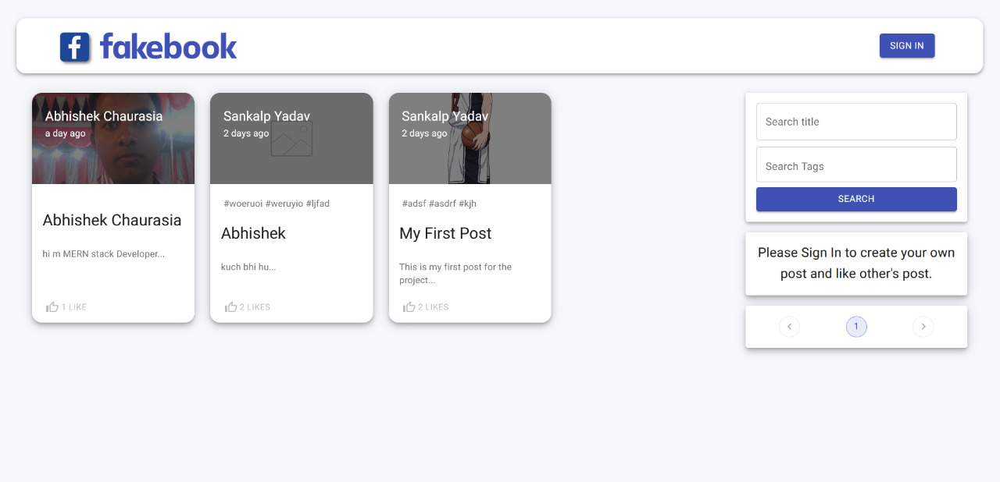

# Memories



## Introduction

Using React, Node.js, Express & MongoDB you'll learn how to build a Full Stack MERN Application - from start to finish. The App is called "FakeBook" and it is a simple social media app that allows users to post interesting events that happened in their lives.


Setup:
- run ```npm i && npm start``` for both client and server side to start the app

TODO: 
    rename post message, 
    refactor reducers, 
    add some cool Posts, 
    maybe clickable tags, 
    fix update functionality
